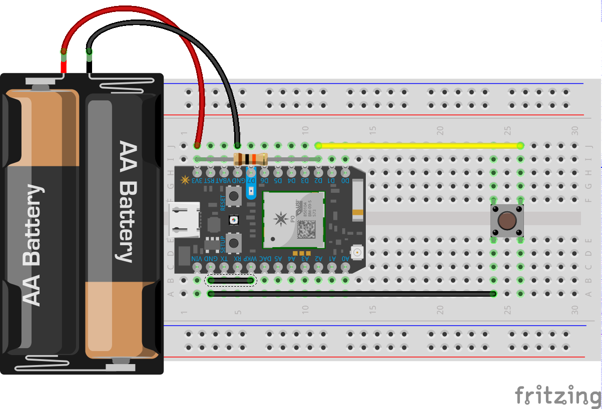

# Particle IoT Button
This project started as a simple maker replacement for an Amazon AWS IoT Button. It is a learning endeavor that turned into a collaboration with @tikurahul as well as an exercise in iterating on hardware and cloud services. The firmware in this project is meant to connect to cloud services provided by the [iot_button](https://github.com/tikurahul/iot-button) project.

## How Do I Use It?
### Connect the Hardware

### Get the Code
Get your Particle device [set up and connected to your WiFi](https://docs.particle.io/start/). To install the firmware on your Particle device simply copy the contents of [iot-button.ino](./iot-button.ino) into a Particle Build or Particle Dev project. Currently the click behavior is hard-coded but you can modify the `callCloudService()` function to perform any IoT task you want.

## How Do I Update It?
Because the button is meant to be battery powered it takes advantage of the low power modes offered by the Particle firmware. That means that it spends most of its time asleep and therefore can't be updated from the cloud. There is a task to fix this but in the meantime you simply perform the following steps to get your device into an update mode.

1. Press and hold both buttons on the device.
2. Release the Reset button only.
3. As soon as the LED flashes magenta release the Setup button.

At this point the RGB LED should be flashing magenta. That means your Particle device is ready to receive a firmware update via the cloud using Particle Build, Particle Dev, or the Particle CLI.

## Supported Devices
Currently the firmware has only been tested on a Photon but theoretically it should run just fine on a Core or Electron as well as a P1 module-based project.

## Task List
Currently the project is in its infancy. Here are some enhancements to make it more useful to potential users. If you want to help I'm happy to take PRs.

- [ ] Register device on setup using System.deviceID
- [ ] Set device cloud job id via a REST call to Particle Cloud
- [ ] Create a 3D printed case
- [ ] Test on a Core and Electron
- [ ] Check for firmware updates on some interval

